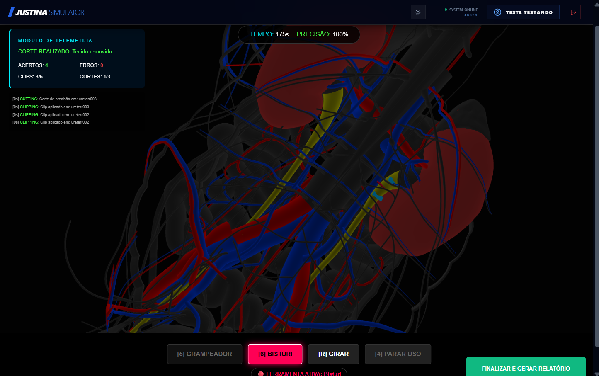
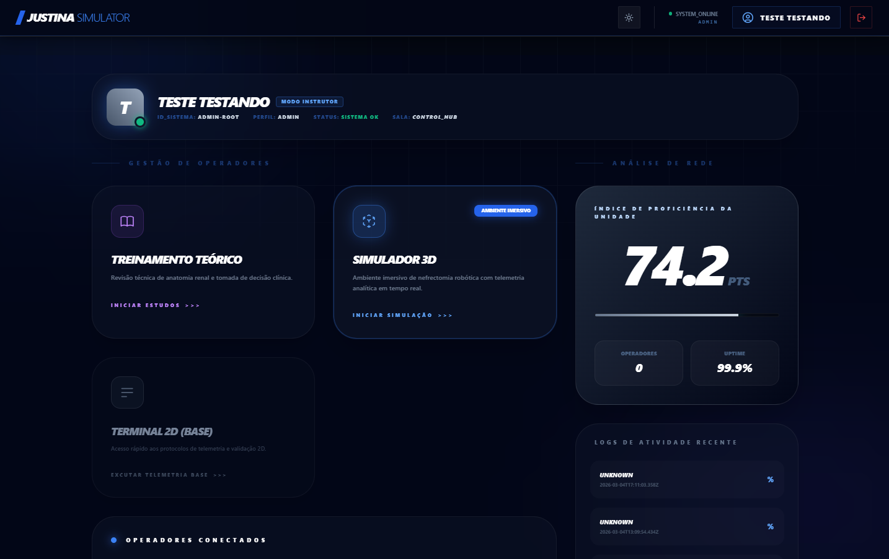

# Justina Virtual Platform


Plataforma completa de simulação cirúrgica com telemetria em tempo real, treinamento teórico estruturado e análise de desempenho com Inteligência Artificial.

O sistema foi desenvolvido como uma solução educacional e tecnológica para validação de habilidades, acompanhamento de progresso e geração de métricas de performance.

Este repositório contém a arquitetura completa do sistema:

- Frontend (Simulador Web 3D)
- Backend Telemetry (Microsserviço principal)
- AI Service (Análise de métricas e geração de feedback)

---

## Estrutura do Repositório
```text
/
├── frontend/
├── backend_telemetry/
├── ai_service/
└── README.md
```
---

## Funcionalidades da Plataforma

### 1. Níveis de Acesso (RBAC)
* Trainee: Foco em simulações, treinamentos teóricos e acompanhamento de evolução individual.
* User: Permissões de Trainee somadas à criação de perguntas e gestão de perfil.
* Admin: Gestão completa de conteúdo, usuários, métricas globais e estrutura educacional.

### 2. Módulos de Treinamento
* Teórico: Sessões estruturadas de perguntas e respostas, vídeos explicativos e avaliações por módulo.
* Simulação Digital: Experiências 2D e 3D em tempo real com captura de movimentos e telemetria.
* Inteligência: Processamento automático de dados com geração de score via IA.



### 3. Monitoramento e Performance
* Dashboard Individual: Visualização de desempenho e evolução histórica para o usuário.
* Dashboard Administrativo: Monitoramento de métricas de utilização e avaliação geral de todos os perfis.



---
## Arquitetura do Sistema


---
## Stack Tecnológica

### Frontend
- React
- Three.js
- JavaScript
- React Router
- Vite
- TailwindCSS
- Zustand

### Backend
- Java
- Spring Boot
- Spring Security
- JPA / Hibernate
- PostgreSQL
- Docker
- Swagger

### AI Service
- FastAPI
- PyTorch
- NumPy
- SciPy
- Google Generative AI

O AI Service recebe dados de telemetria gerados durante as sessões de simulação.

Esses dados são processados utilizando análise numérica (NumPy / SciPy) e posteriormente enviados para um modelo de IA generativa que produz um feedback textual detalhado sobre o desempenho do usuário.

---
## Como Executar o Projeto

### 1. Clonar o Repositório
```bash
git clone https://github.com/No-Country-simulation/S02-26-E25-JustinaVirtual
cd S02-26-E25-JustinaVirtual
```

---

### 2. Iniciar os Serviços com Docker

```bash
docker compose up --build
```

Isso irá iniciar:

- PostgreSQL
- Backend Spring Boot
- Serviço de IA FastAPI

---

### 3. Iniciar o Frontend

Acesse o diretório do frontend:

```bash
cd frontend
```

Instale as dependências:

```bash
npm install
```

Inicie o servidor de desenvolvimento:

```bash
npm run dev
```

---

## Variáveis de Ambiente

Exemplo de configuração do backend:

```text
spring.application.name=JustinaBackend
server.servlet.context-path=/api

gemini.api.key=${GEMINI_API_KEY:chave_fake}
```

---

## Ambiente de Produção

Frontend:
https://s02-26-e25-justina-virtual.vercel.app/

Backend:
https://justina-backend.onrender.com/api

Swagger:
https://justina-backend.onrender.com/api/swagger-ui/index.html

AI Service:
https://s02-26-e25-justinavirtual.onrender.com

---

## Segurança

- Backend protegido com Spring Security
- Sistema baseado em papéis (Role-Based Access Control)
- Endpoints de telemetria liberados para ingestão automática
- Estrutura preparada para autenticação JWT

---

## Banco de Dados

Desenvolvimento:
- H2 (in-memory)

Produção:
- PostgreSQL via variáveis de ambiente

---

## Objetivo do Projeto

Este projeto tem como finalidade:

- Validar arquitetura escalável
- Testar integração entre frontend, backend e IA
- Implementar pipeline de telemetria em tempo real
- Criar uma plataforma educacional completa
- Aplicar boas práticas de engenharia de software
- Construir base para expansão futura (inclusive hardware físico)

---
